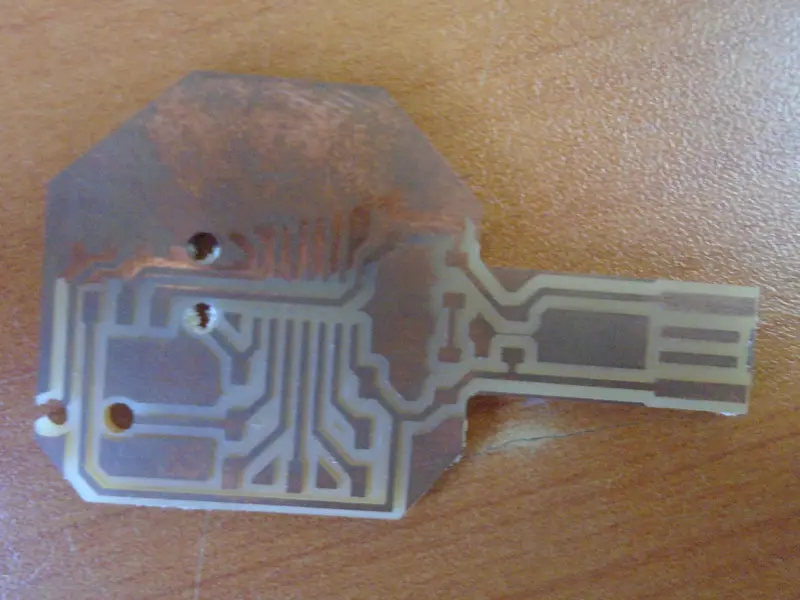
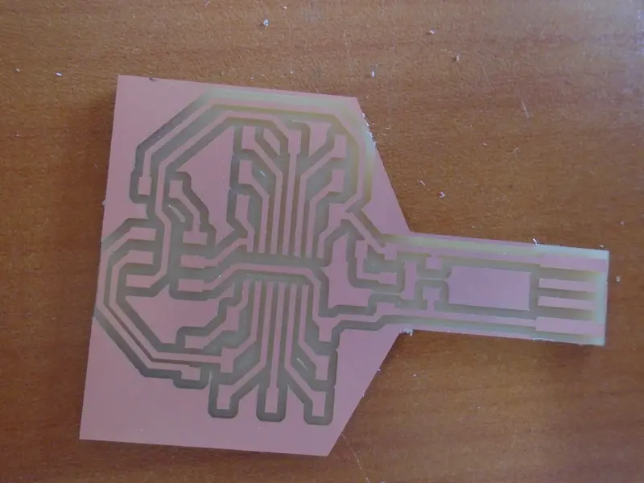
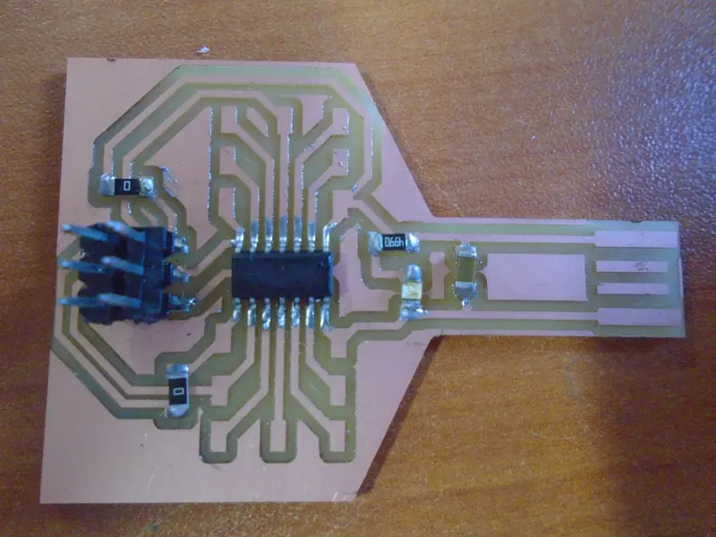
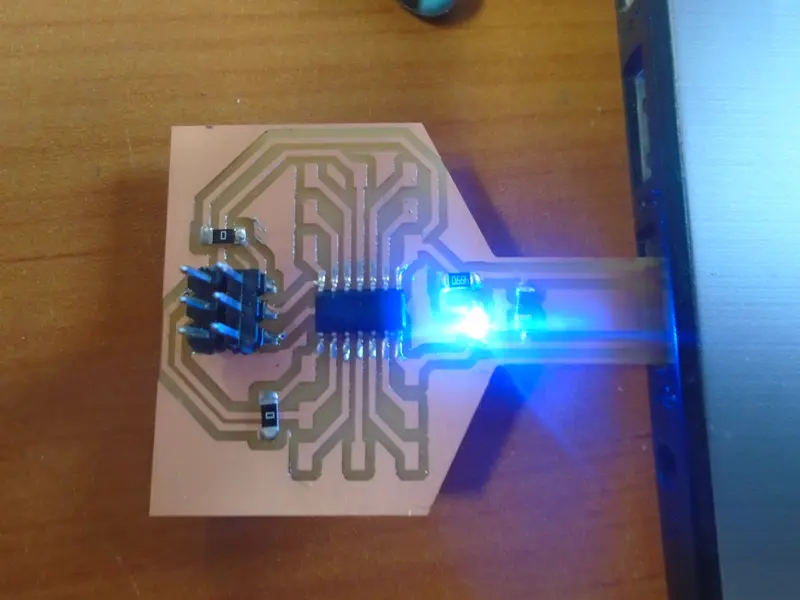
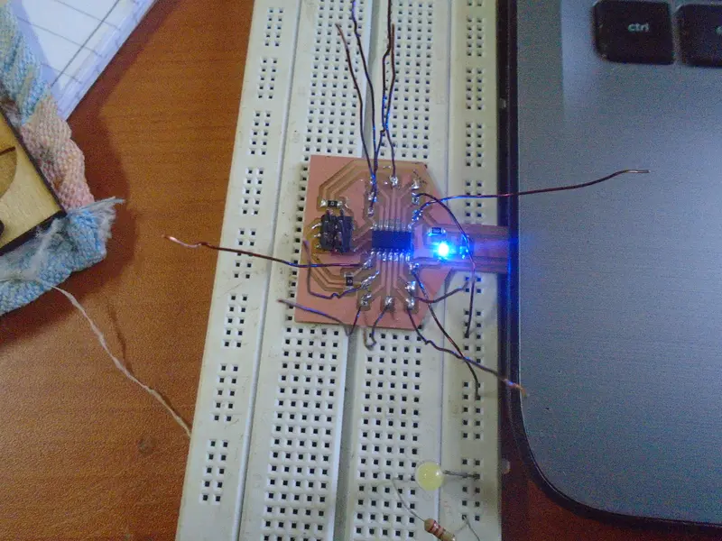
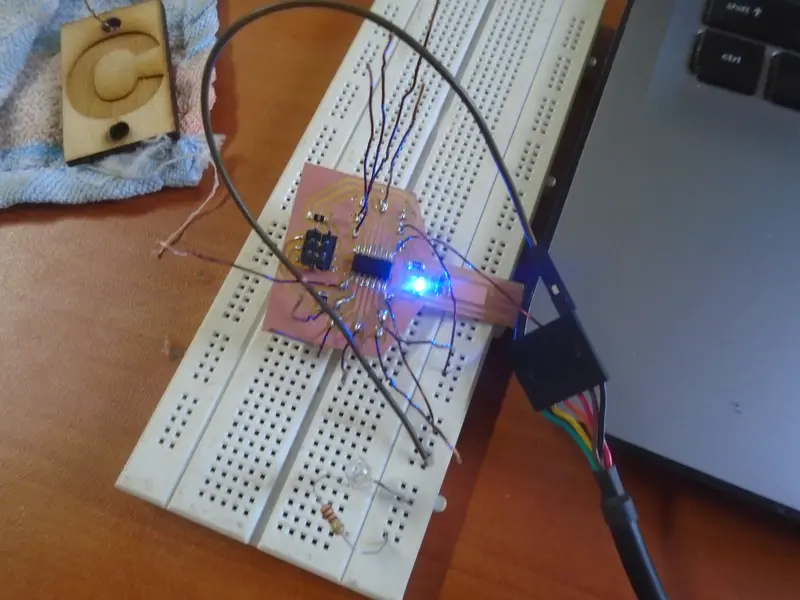

## attiny 44 with usb port

- first try
- 
- failed because of small usb wide and bad leveling of the plate of monofab machine.
- i changed the wide of the usb port and leveling the monofab using modela and 3mm bit
- second try
- 
- adding components
- 
- testing the circuit
- 
- adding wires to connect it to other devices
- 
- try powering the board using ftdi
- 
