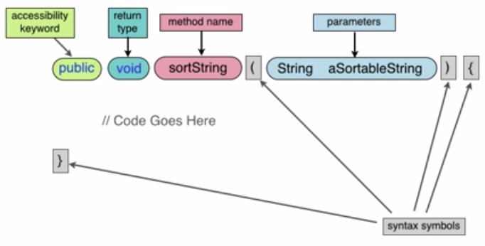
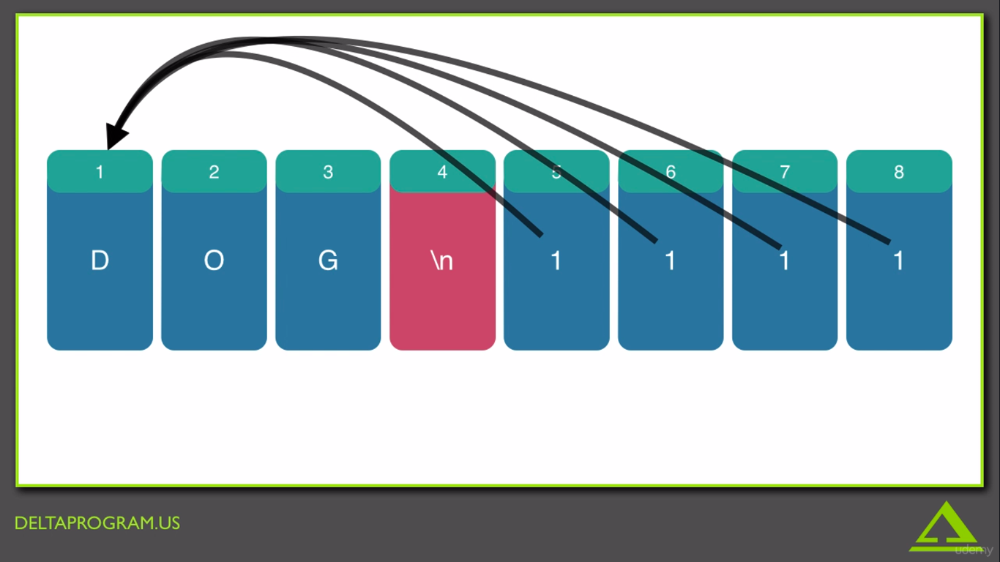
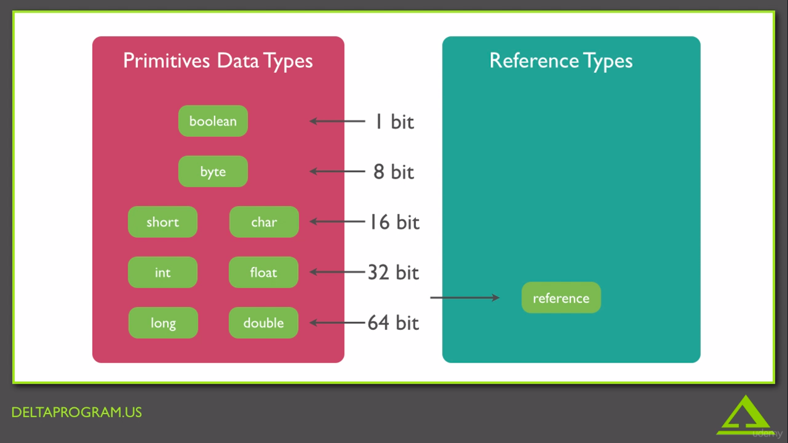

# Become-an-android-developer-from-scratch

## [Welcome video](https://www.udemy.com/course/become-an-android-developer-from-scratch/learn/lecture/1046310#overview)

## [Why android studio](https://www.udemy.com/course/become-an-android-developer-from-scratch/learn/lecture/2128242#overview)

- `IDE` : integrated development environment
  - it helps your while your coding
  - give you feed backs
  - it is fast because of the auto complete mechanism
  - better to troubleshoot because of debugging feature
  - i can change class name in all of my program easily, don't need to search for each file

## [The best tool to develop your app](https://www.udemy.com/course/become-an-android-developer-from-scratch/learn/lecture/2128244#overview)

- there are three ways to test your app
  - first your can use emulator : has problems
  - second use a physical device : better but have to test on specific number of device, depending on what you own
  - use genymotion : best way

## [Files, packages, classes and methods](https://www.udemy.com/course/become-an-android-developer-from-scratch/learn/lecture/1009674#overview)

- Java code components
  - File
  - class
  - attribute
  - methods
  - 
  - 

## [Syntax symbols](https://www.udemy.com/course/become-an-android-developer-from-scratch/learn/lecture/1009678#overview)

- 
- case of the writing : how you write variables or methods or any name
  - `camelCase` : small first word `camel` and capital the second one `Case`
  - `PacalCase` : capital each word

## [Method signature](https://www.udemy.com/course/become-an-android-developer-from-scratch/learn/lecture/1009686#overview)

- there are five components for the java method signature
  1. accessibility keyword, this defines what has access to this method
  2. the return value type, even if there is no return value
  3. method name, so we can call it
  4. syntax symbols like parenthesis or braces
  5. parameters, these are the inputs to the method
  - 
  - 

## [Data types and variables](https://www.udemy.com/course/become-an-android-developer-from-scratch/learn/lecture/1009702#overview)

- attribute is in the beginning of the class
- how to differentiate between class and method
  - the class's name followed by braces {}, it's better to use PascalCase to define it
  - the method's name followed by parenthesis (), it's better to use camelCase to define it
- example of class, a private method and variables
  ```
  // class definition
  public class MyInfo
  {
    // attributes
    int myAge = 33;
    String myName = "Ahmed";
    boolean isMale = true;
    char middleInitial = 'M';
    float myHeightInMeters = 1.6f;
    // method definition
    private void updateMyInfo ()
    {
      myAge = 35;
      myName = "Ahmed Khairy";
    }
  }
  ```

## [Memory lockers](https://www.udemy.com/course/become-an-android-developer-from-scratch/learn/lecture/1157038#overview)

- memory
- reading, writing
- pointers, that used when one location is not sufficient, so it give it the beginning of the memory that can be used

## [Introduction to computer memory](https://www.udemy.com/course/become-an-android-developer-from-scratch/learn/lecture/1012938#overview)

- if we use pointer it won't be known where is the end of that variable until we put `\n` that's mean the end of that variable, the benefit of pointer that i can use data without copying it
- 
- there are two different data types
- 
- it is better to reduce the usable memory as possible
- 

## [Reference and null](https://www.udemy.com/course/become-an-android-developer-from-scratch/learn/lecture/1012942#overview)

- references are pointers
- to define a reference you use : `int[] new = new int [4];`
  - this code means that this is an int array called new and it reserves 4 places in memory each place is int data type
- to assign value to each place : `new [0]= 2;`, and so one to `new [3]`
- if i want to make reference but not giving it a memory we use : `int [] new;`, this declaration make the reference equal `null`
- so for example if i create another reference : `int[] new2;` it's value will be `null`
- i can make the new reference points to the value of the first reference by writing : `new2 = new;`, but if i assign a `null` to `new` reference, the `new2` still point to the same data

## [Android studio](https://www.udemy.com/course/become-an-android-developer-from-scratch/learn/lecture/1012948#overview)

- installing android studio
- sdk manager installing

## [Arrays](https://www.udemy.com/course/become-an-android-developer-from-scratch/learn/lecture/1013024#overview)

- if i want to declare one `int` variable i can use `int x`, but if i want to declare array of `int` variables i can use `int []`
- i can set array elements by
  ```
  int [] myArray = new int [5];
  myArray [0] =  0;
  myArray [1] = 4;
  etc ...
  ```
  ```
  int [] myArray = {0,4,etc,...}; //the size of the array is defined depending on the elements
  ```

## [Lists](https://www.udemy.com/course/become-an-android-developer-from-scratch/learn/lecture/1013026#overview)

- list types
  - arraylist
  - linkedlist
  - vector
- difference between array and list
  - `String[] days = {"sat","sun","mon","tue","wed","thur","fri"}` : array
    - if i want to insert an element between them i have to create new array then take the elements before the inserted element then add the new element and take the other elements from the original array and so on
  - `ArrayList<String> myList = new ArrayList<String>();` : define a collection in java
    - if i want to add elements to that list i will use `myList.add("first"); myList.add("second"); myList.add("fourth");`
    - if i want to insert an element between them i will just use the index number and use add `myList.add(2,"third");`

## [Sets](https://www.udemy.com/course/become-an-android-developer-from-scratch/learn/lecture/1013028#overview)

- it is used to store data that is unique and never duplicate
- types of Sets
  - hashset
  - treeset
  - linkedhashset
- if i want to store data like
  ```
  HashSet<String> mySet = new HashSet<String>();
  mySet.add("one");
  mySet.add("two");
  mySet.add("three");
  mySet.add("two"); // this won't be added, it will keep just one of them
  ```

## [Maps](https://www.udemy.com/course/become-an-android-developer-from-scratch/learn/lecture/1013030#overview)

- it is used to give a key to an element instead of index number like
  ```
  key >>>> value
  0   >>>> "cat"
  1   >>>> "dog"
  200 >>>> "anything"
  ```
- types of maps
  - hashmap
  - hashtable
  - treemap
- to declare a map
  ```
  HashMap<String,String> myhashmap = new HashMap<String, String>();
  myhashmap.put("mykey","dog"); //to put elements
  myhashmap.get("mykey"); //to get it
  ```
- to make a list of key maps
  ```
  HashMap<String,HashMap<String,String>> newhashmap = new HashMap<String,HashMap<String,String>>();
  newhashmap.put("USA",newhashmap);
  ```

## [Objects and 'new'](https://www.udemy.com/course/become-an-android-developer-from-scratch/learn/lecture/1013032#overview)

- java is an object oriented programming
- differences between class and Object
  ```
  public class MyClass  //this is class (blue print)
  {
    String variable = "moose";
    public MyClass (String aString)
    {
      variable = aString;
    }
  }
  ```
- to get from a class to an object, we use the `new` keyword
  - `MyClass myObject = new MyClass();`
  - this will point to MyClass memory, it takes it's blue print
- if i use this command
  - `MyClass otherObject`
  - this will point to `null`
- if i create an array of objects the inheret from `MyClass`
  - `MyClass[] someObjects = new MyClassp[5];`
  - all of them will point to null, i have to assign to each object like
    - `someObjects[0]= myObject`

## [Constructors and allocation](https://www.udemy.com/course/become-an-android-developer-from-scratch/learn/lecture/1013034#overview)

- `MyClass myObject = new Myclass();`
  - `MyClass` : is the class i want to make object from
  - `myObject` : name of the new object
  - `new` : keyword
- but why is there a parenthesis?

  - we use parenthesis when we deal with methods, but how ?

  ```
  public class MyClass
  {
    String memberVariable = "moose";
    public MyClass()
    {

    }
    public MyClass (String aString)
    {
      memberVariable = aString;
    }
  }
  ```

  - first and second methods are called constructors, because they are called when constructing the object for the first time
  - even if we didn't create them, they will be generated for us

## [Garbage collection and null](https://www.udemy.com/course/become-an-android-developer-from-scratch/learn/lecture/1013036?components=buy_button,introduction_asset,purchase#overview)

- it is used to un allocate memories locations to free up spaces
- java keep track of memory spaces and count how many times the program points to that location

## [Operators and assignments : bitwise and unary](https://www.udemy.com/course/become-an-android-developer-from-scratch/learn/lecture/1013042#overview)

## [The return statement](https://www.udemy.com/course/become-an-android-developer-from-scratch/learn/lecture/1013044#overview)

##[The if statement](https://www.udemy.com/course/become-an-android-developer-from-scratch/learn/lecture/1043000#overview)

## [Compiling and depugging](https://www.udemy.com/course/become-an-android-developer-from-scratch/learn/lecture/1013100#overview)
