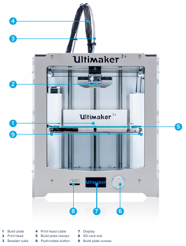
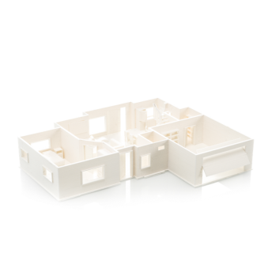
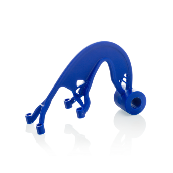

# 3D printer - ultimaker 2+

  

## Purpose

- Example prints using Ultimaker PLA

  - Precise model visualization  
    

  - Detailed concept models  
    

  - Low melting temperature  
    

- Example prints using Ultimaker ABS

  - Test your prototypes  
    

  - Fit testing  
    

  - Versatile capabilities  
    

- Example prints using Ultimaker CPE

  - Adaptable and versatile  
    

  - Reliable, chemical resistant parts  
    

  - Complex geometries are easy  
    

## Minimum knowledge to use machine

- Filament diameter : 2.85 mm
- Print head travel speed : 30 to 300 mm/s
- Nozzle diameter : 0.25, 0.4, 0.6, 0.8 mm
- Nozzle heat up time : ~ 1 minute
- Dimensions : 357 x 342 x 388 mm
- SOFTWARE
  - any 3d software that output these extensions (STL, OBJ, DAE)
  - Cura for export printing file from `stl, obj or dae` files

## Materials

- Supported materials : PLA, ABS, CPE

## Working time

- monday
- wednesday

## Maintenance

### Procedures

- `CLEANING THE GLASS PLATE` : After a lot of printing, there might be too much excess glue stuck to the glass plate. This can cause an uneven print surface and it is therefore recommended to clean the glass plate once in a while.
- `FEEDER TENSION` : In order to guide the filament properly through the feeder into the bowden tube and print head, it is important that the tension on the feeder is set correctly, If the tension is too high, it means that the knurled wheel of the feeder will dig into
  the filament, through which it flattens or gets stuck. This is called grinding. To prevent grinding of the filament, ensure that the white insert clip at the right side of the feeder is set in the middle.  
  
- `LUBRICATING THE AXES` : To maintain your Ultimaker 2+ correctly and keep it running smoothly, it is recommended to lubricate the axes periodically
  - When you notice small ridges on the surfaces of your 3D printed objects or feel that the X and Y axes are dry, it is advised to put a single drop of sewing machine oil onto the X and Y axes. This will help your Ultimaker 2+ to run smoothly. Sewing machine oil is not included in the Ultimaker 2+ package, but we highly recommend using only this to lubricate the X and Y axes.  
    
  - Once every 6 months, the Z trapezoidal leadscrew has to be lubricated with Magnalube. This is the green grease that was delivered with your Ultimaker 2+. Spread 10 drops of grease over the entire threaded rod. With your next print, the Ultimaker 2+ will lubricate the axis by moving up and down.  
    
- `ATOMIC METHOD` : After longer use of your Ultimaker 2+, you might notice that it cannot extrude enough plastic anymore. This so called under extrusion is usually shown by very thin or missing layers in a print. In most cases, it is caused by some dirt or carbonized material in the nozzle or another hot end part through which a (partial) blockage is created
  1. remove the filament
  2. remove the tube  
     
  3. heat up the nozzle to 260 Degree
  4. Cut off approximately 20 cm of filament with a straight cut and try to straighten the filament as much as possible
  5. When the temperature is reached, insert the straightened piece of filament manually all the way down to the nozzle
  6. Push it slightly until either the new filament comes out of the nozzle or until the filament cannot be pushed any further.  
     
  7. Lower the temperature to 90 degrees
  8. Pull the filament out with a quick, firm pull, once the temperature has been reached
  9. Repeat “heating up and preparing” and “removing the new filament” until the filament comes out without any residue and has a cone-shaped tip.  
     

### Date

- Yearly maintenance
  - sunday `1\9\2019` hardware maintenance (cleaning, greasing, leveling tha plate, fix the nozzle)
  - test the machine

## Advanced

- for troubleshooting
  - https://all3dp.com/1/common-3d-printing-problems-troubleshooting-3d-printer-issues/
  - http://mactech.sheridanc.on.ca/techs/mark-galaszkiewicz/ultimaker-2-advanced-maintenance-troubleshooting/
