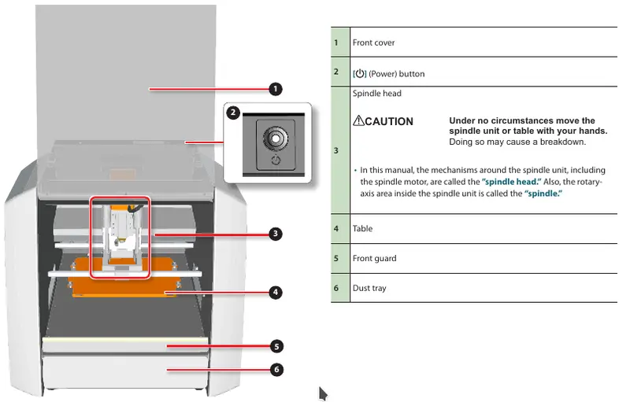  
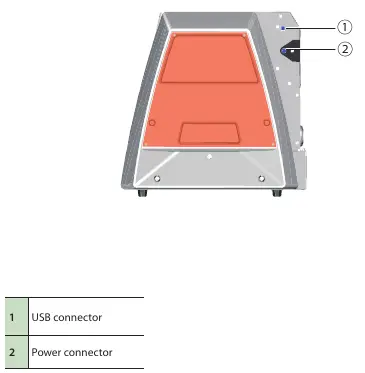

## Purpose

- This machine is capable of cutting a wide variety of materials including chemical wood, acrylic, and ABS
- it can be used in milling, casting or pcb production

## Minimum knowledge to use machine

- cutting tools  
  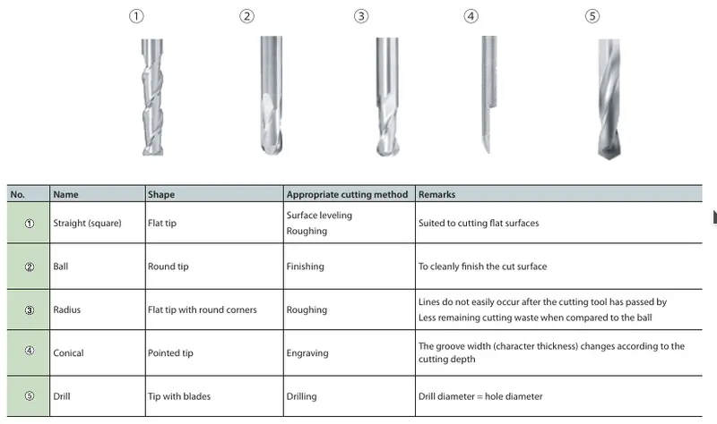

- cutting area x,y  
  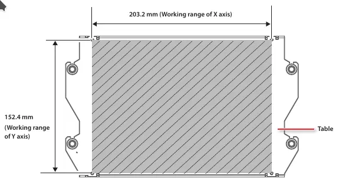

- cutting area z  
  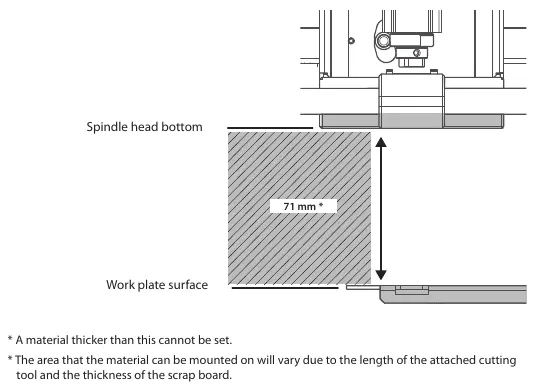

- softwares used

  - `vpanel` : to control the axis and start the job  
    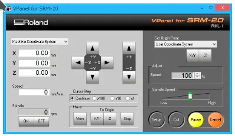

  - `SRP Player` : This is a CAM software that imports general-use 3D data, (such as IGES, DXF (3D), or STL), and lets you easily prepare tool paths and output them to the SRM-20.  
    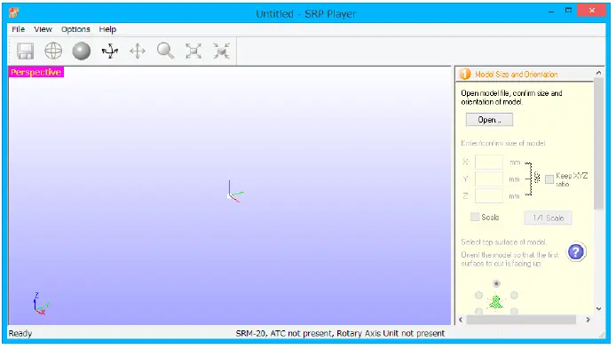

  - `Modela Player 4` : This is a CAM software that imports general-use 3D data, (such as IGES, DXF (3D), or STL), and lets you easily prepare tool paths and output them to the SRM-20.  
    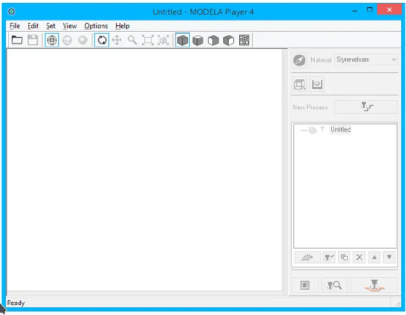

- The Flow of One Side Cutting  
  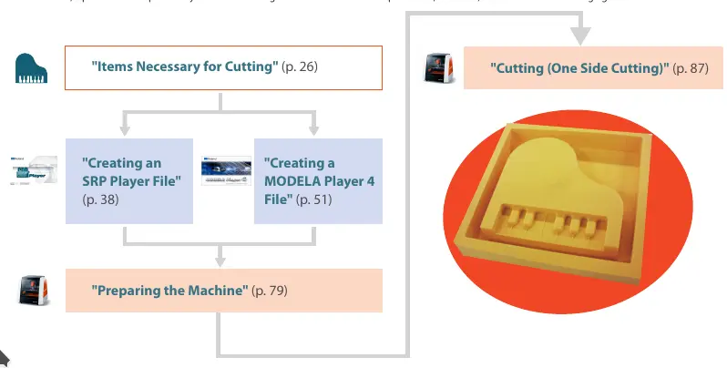

- Preparing the Machine  
  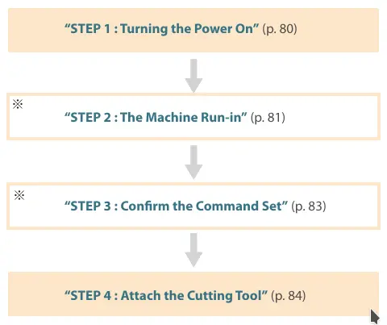

- attaching the cutting tool  
  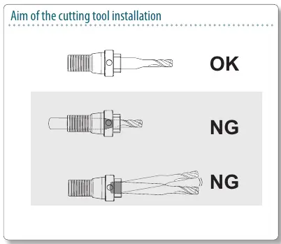  
  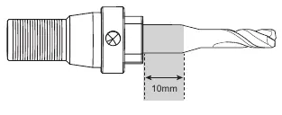

- attach the material to the table

  - Mark the location that will be the origin point of the material.  
    

  - Stick double-stick tape on the material.  
    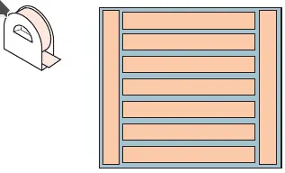

  - set the origin of the vpanel  
    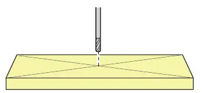

- Loadable workpiece weight : 2 kg
- operating speed : 6 ~ 1800 mm/min
- maximum spindle rotation : 7,000 rpm

## Materials

- Chemical wood
- Sanmodur
- ABS
- Modeling wax

## Working time

- monday
- wednesday

## Maintenance

- 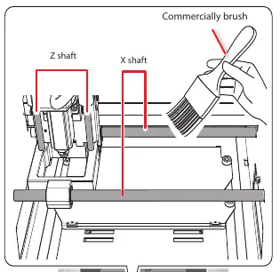
- 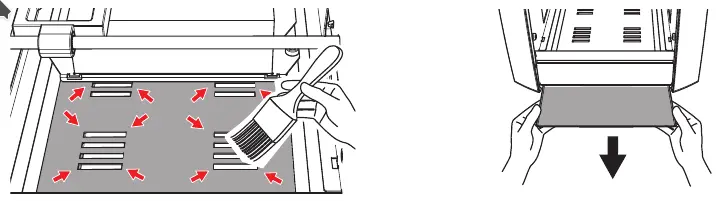
- 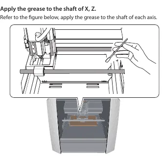
- 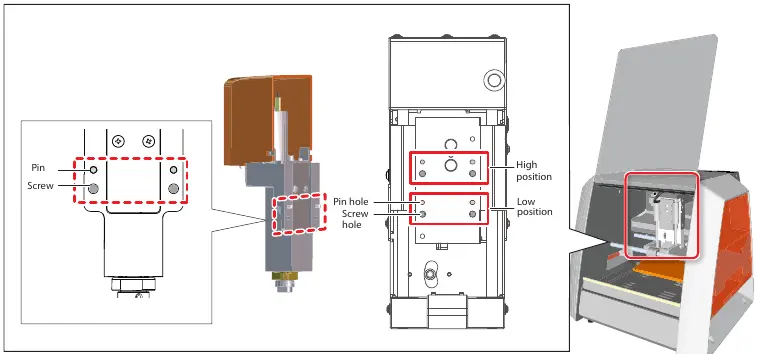

### Procedures

- lubricate and grease the axis and rail
- clean the container under the plate
- make sure the layer above the plate is leveled
- suck the wasted wood, wax or cubber from the machine

### Date

- Yearly maintenance
  - sunday `1\9\2019` hardware maintenance (cleaning, greasing)
  - monday `2\9\2019` software maintenance (installing O.S, softwares, mods, local server)
  - test the machine

## advanced

- Z Cutting Range by Changing the Position of the Spindle Unit  
  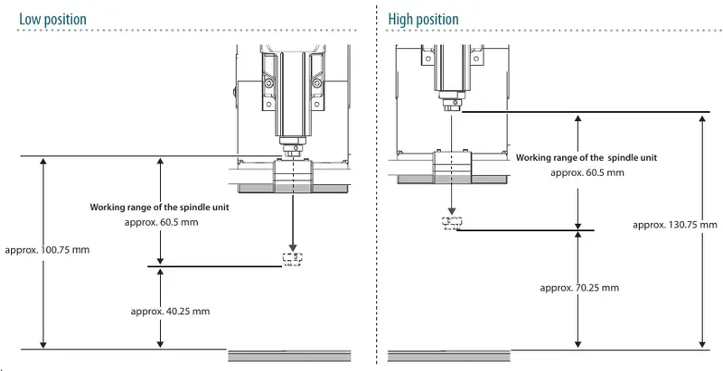
