# Fablab Team members activities
## FabLab Team sixth meeting : electronic simulation 30/10/2019
- design requirement
  - using any simulation software to test one of these circuits 555 ic circuit transistor as a switch circuit 7 segment circuit (with decoder or without) h bridge circuit OR ANY CIRCUIT YOU WANT TO TEST, AT LEST HAVE THREE COMPONENTS simulation software : proteus, multisim, .....   your are not restricted to these two
- Boys
  - ahmed
  - 
  - seif
  - 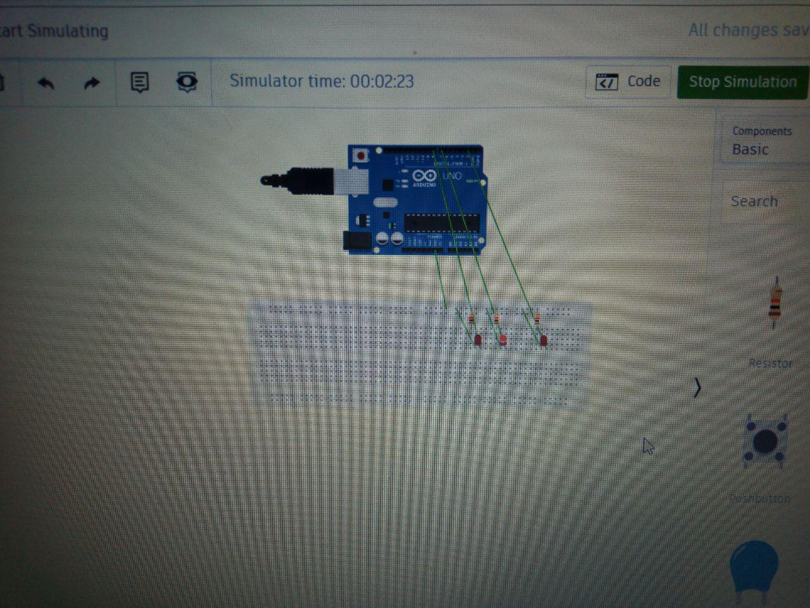
  - abdalrahman
  - 
  - abdallah
  - 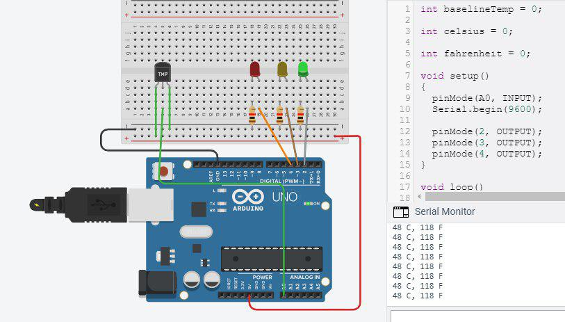
  - 
  - anas
  - zidan
  - 
- Girls
  - nihal
  - 
  - nada
  - 
  - nourhan
  - 

## FabLab Team fifth meeting : 3D design 23/10/2019
- design requirement
    - 5x5x5 cm or a 125 cm square design on 3D design software
- Boys
  - abd alrahman
  - 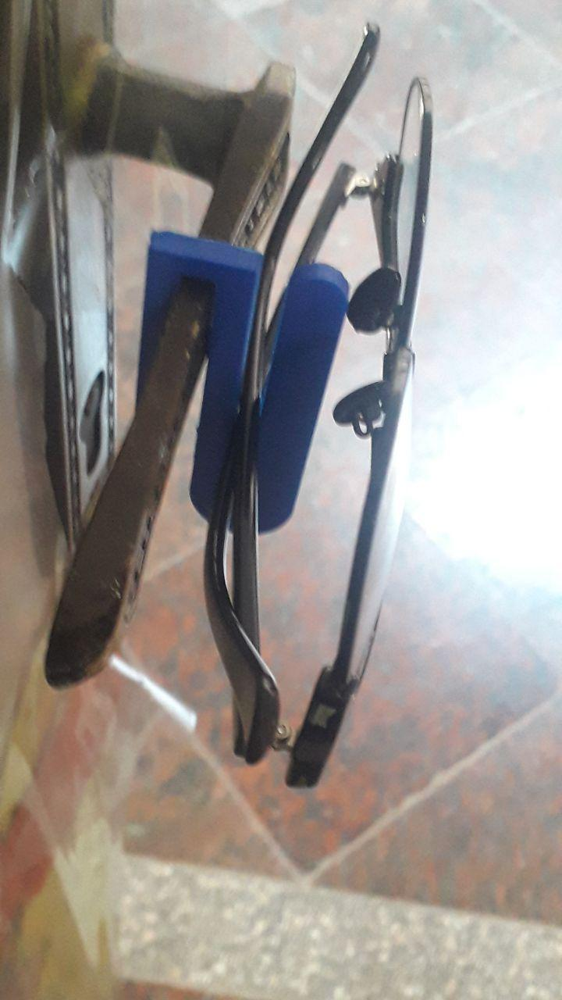
  - 
  - ahmed
  - anas
  - 
  - 
  - 
  - seif
  - 
  - zidan
  - 
  - 
  - 
  - 
  - 
- Girls
  - arwa
  - aya wahba
  - mayar
  - nada
  - 
  - nihal
  - 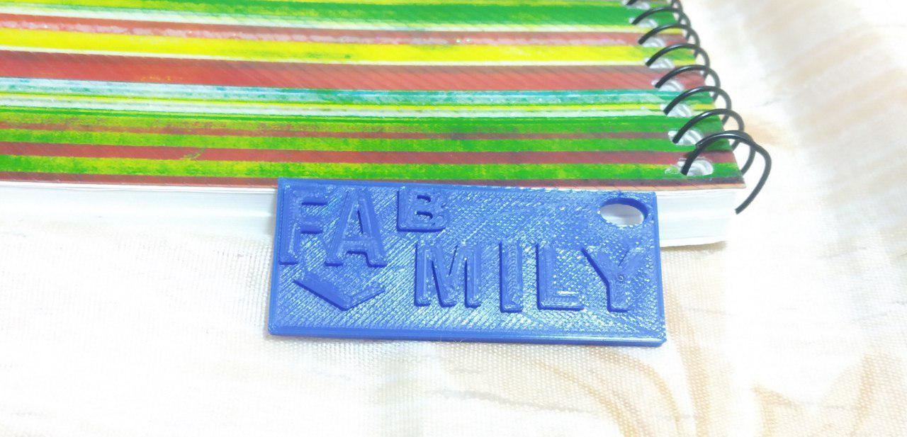
  - 
  - veronica
  - sarah

## FabLab Team fourth meeting : inkscape software and vinyl cutter machine 15/10/2019
- design requirement
    - 7*7 cm design on inkscape software that includes
      - photo
      - text
- Boys
  - abd allah
  - abd alrahman
  - ahmed
  - 
  - anas
  - 
  - hesham
  - 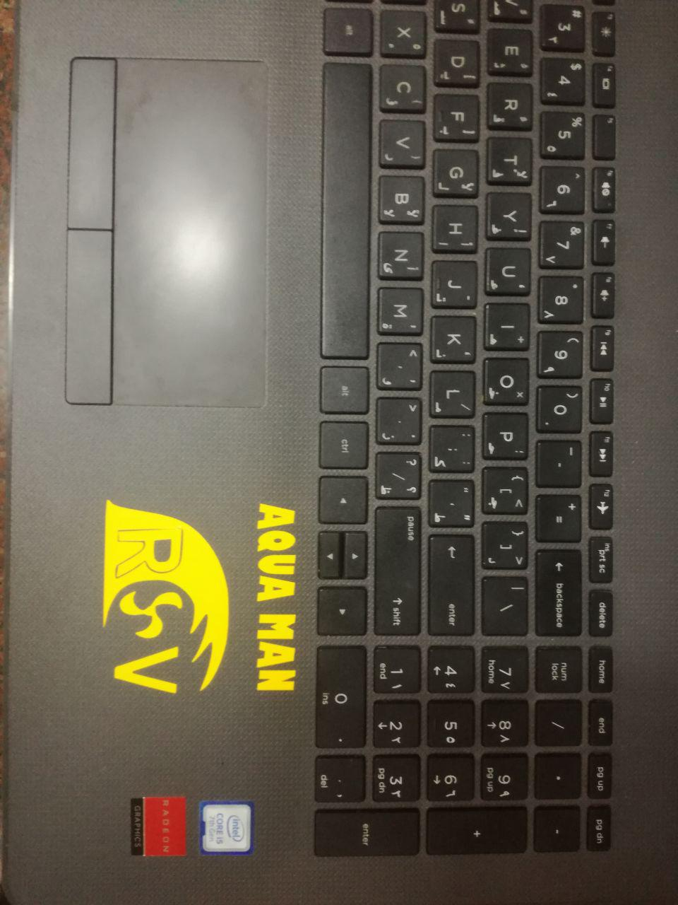
  - zidan
  - 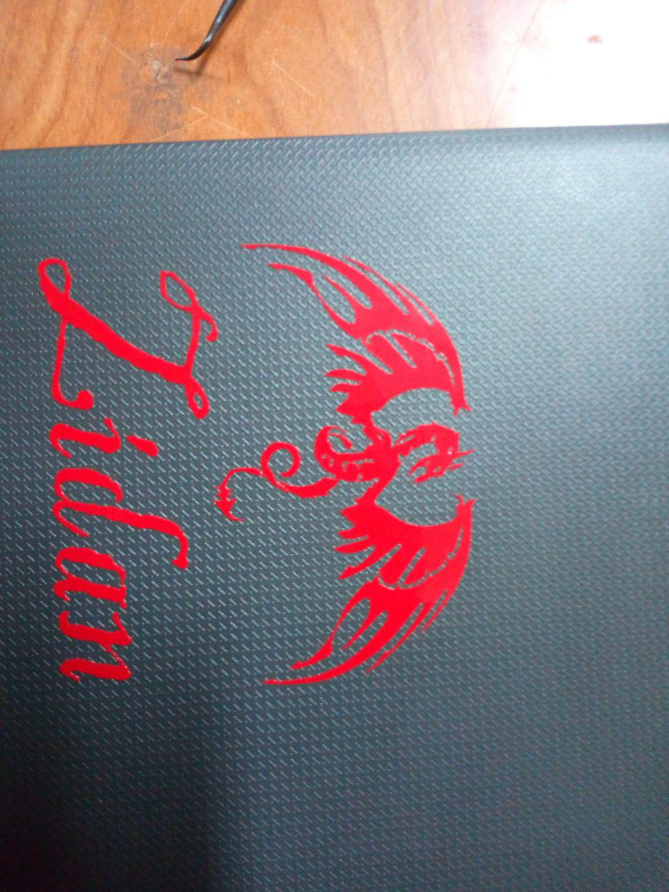
  - 
- Girls
  - arwa
  - aya wahba
  - 
  - nada
  - 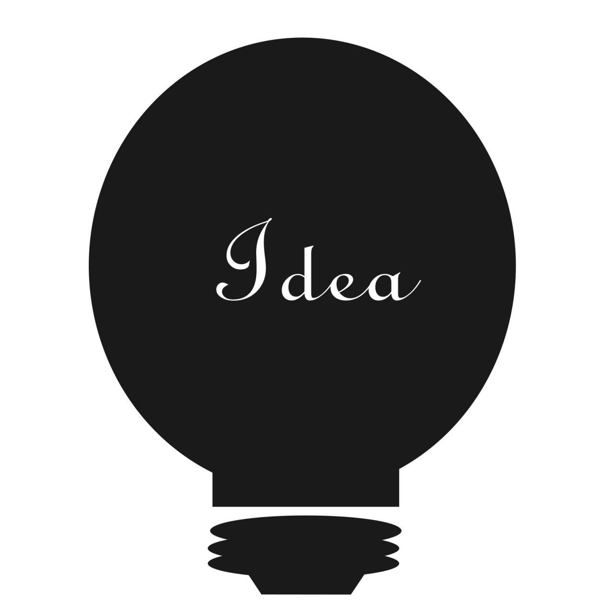
  - 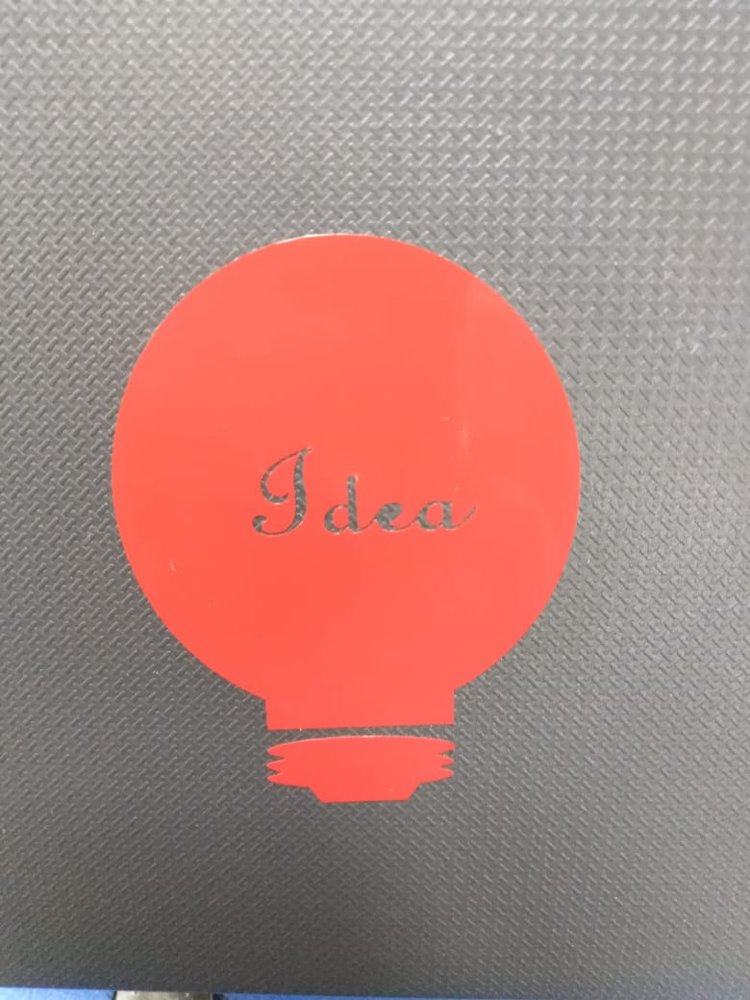
  - nihal
  - nourhan
  - 
  - 
  - sarah

## FabLab Team third meeting : continue eagle PCB design software 9/10/2019
- design requirement
    - using 3.5 * 5 cm board and any electronic circuit they would like to choose
    - use the components from the FabLab
- Boys
    - ahmed
    - 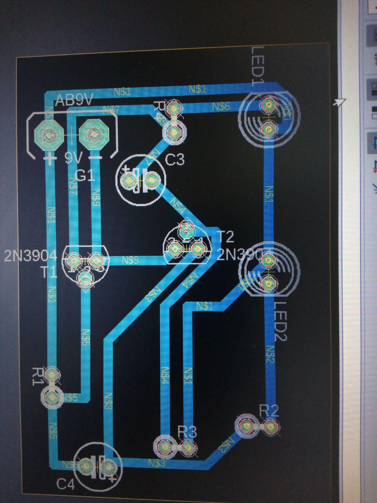
    - seif
    - 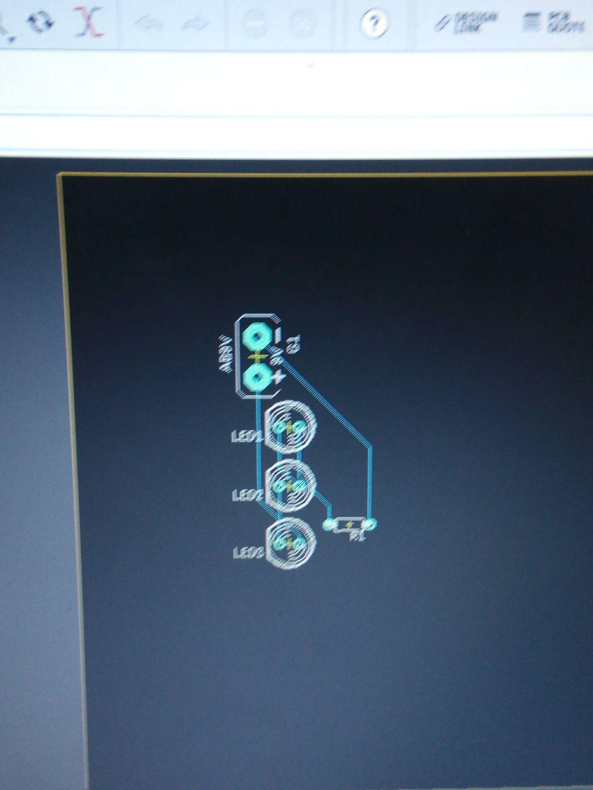
    - zidan
    - 
- Girls
    - arwa
    - 
    - 
    - aya
    - 
    - 
    - mayar
    <!-- -  -->
    - nada
    - 
    - nourhan
    - 
    - nihal
    - 
    - sarah
    - 
    - veronica
    - 
    - 

## FabLab Team second meeting : eagle PCB design software 2/10/2019
- design requirement
    - using 3.5 * 5 cm board and any electronic circuit they would like to choose
    - use the components from the FabLab
- Boys
    - abdallah
    <!-- -  -->
    - abdalrahman
    <!-- -  -->
    - ahmed
    - 
    - anas
    <!-- -  -->
    - seif
    - 
    - zidan
    <!-- -  -->
- Girls
    - arwa
    <!-- -  -->
    - aya
    <!-- -  -->
    - mayar
    <!-- -  -->
    - nada
    <!-- -  -->
    - nourhan
    - 
    - nihal
    <!-- -  -->
    - sarah
    <!-- -  -->
    - veronica
    <!-- -  -->

## FabLab Team first meeting : corel draw and laser cutter 25/9/2019
- design requirement
    - using 10 * 10 cm wood piece and what ever design they would like to choose
- Boys
    - abdallah
    - 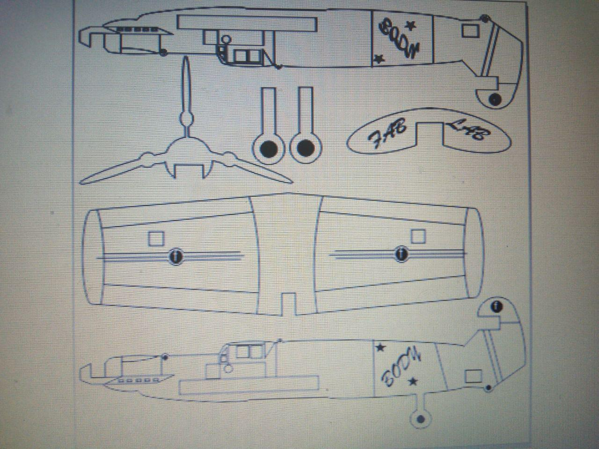
    - 
    - abdalrahman
    - 
    - 
    - ahmed
    - 
    - 
    - seif
    <!-- -  -->
    - 
    - zidan
    - 
    - 
- Girls
    - arwa
    
    - 
    - mayar
    - 
    - 
    - nada
    - 
    - 
    - nihal
    - 
    - 
    - sarah
    - 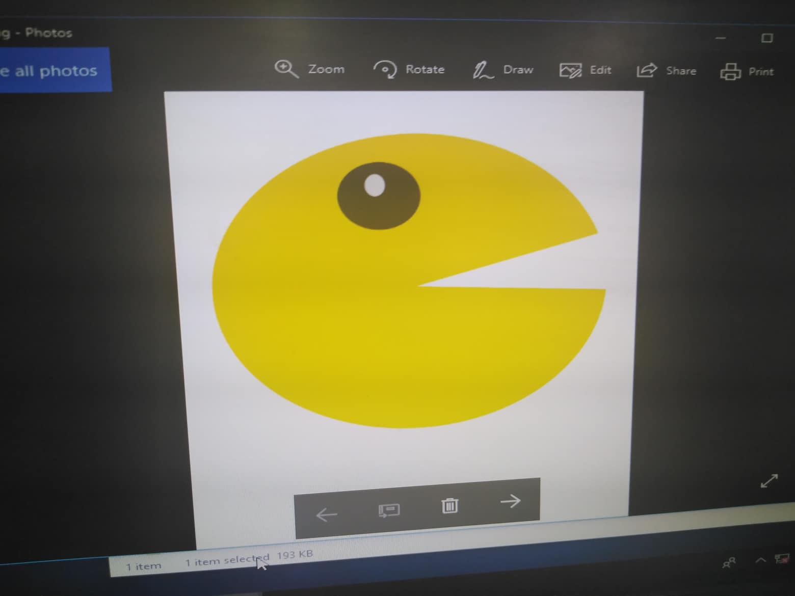
    - 
    - veronica
    - 
    - 

## Zidan - 4/9/2019
- making key chain for the fablab keys
- 
    - first design
        1. I made a rectangle with diminutions 3cm x 5cm that contains `A` letter.
        2. I made 2 circles with diameter 5mm.
        3. I changed the setting of the lines of the triangle and circles to hair line to allow the laser cutter to cut them.
        4. I repeat these steps 7 times, with changing the latter from A to B, C, E, F, G, H and S.
        - 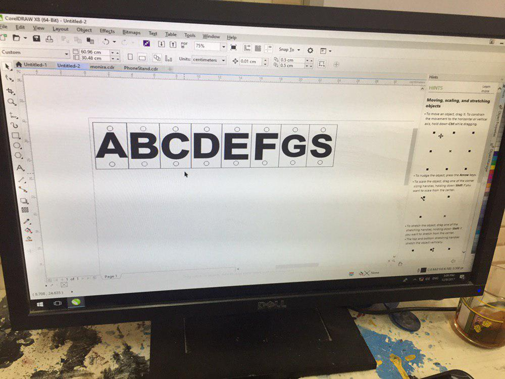

    - second design
        1. I made rectangle with dimentions 30cm*5cm that contains 7 letters and under each letter a circle with diameter 5mm.
        2. I chanced the setting of the lines of the triangle to hair line.
        - 
        - 
    - Finally
        - I made the power of milling `100` and the speed `15` and the power of the cutting `100` and the speed `45`.
        - 
        - 
        - 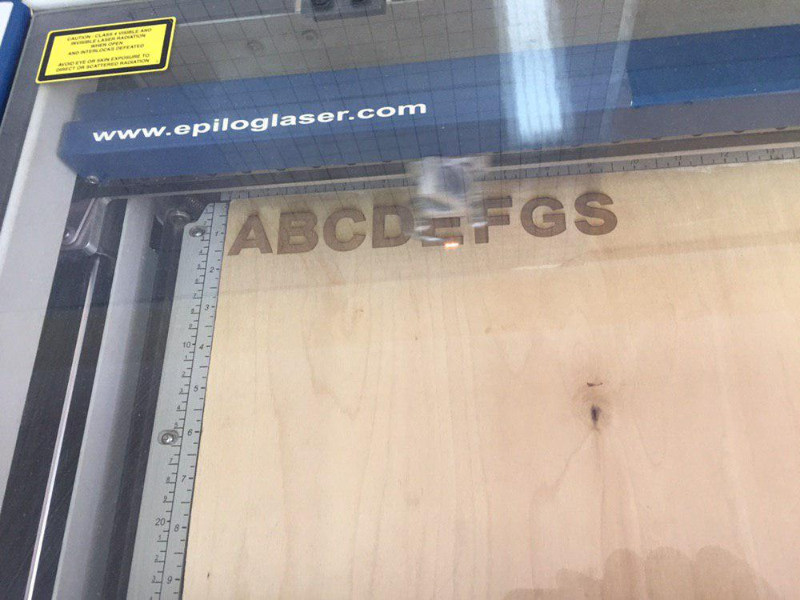
        - 
        - 
        - 

## Zidan - 3/9/2019

    - using freecad to design a pyramid and print it on 3d printer
    - I made the layers that was:
        1. first layer was 5cm width, 5cm length and 1cm height.
        - 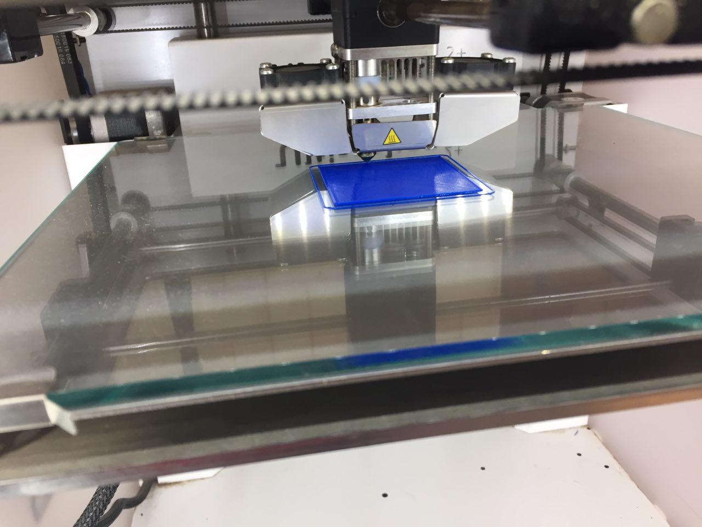
        - 
        2. second layer was 4cm length, 4cm width and 1 cm height.
        - 
        3. third layer was 3cm length, 3cm width and 1cm height.
        - 
        4. Fourth layer was 2cm length, 2cm width and 1cm height.
        - 
        - 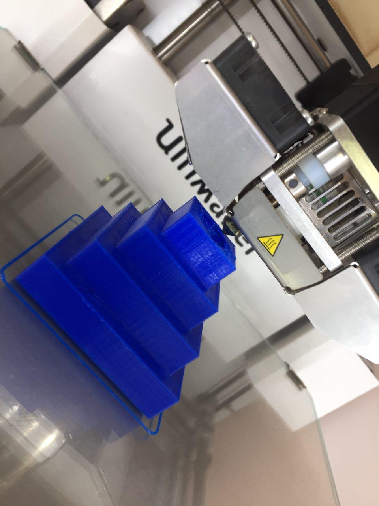
        5. Last layer was cubic 1\*1\*1.
        - 
    - Then I grouped them into one shape.
    - After that I saved the project as `stl`.
    - Then used cura application to convert it to `gcode` and saved it in SD card
    - Finally, I put the card in the 3D printer to start print. It takes 1.15 hour to protect this shape.
    - [pyramid file](/team/pyramid.stl)

## Nourhan - 2/9/2019

    - installing windows OS on machine's computers
    - installing ubuntu OS on machine's computers
    - organizing fablab according to the new layout
