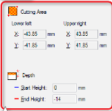

# Girls documentations

## Gehad zein - milling

- after finish the design, export `stl` file
- open `modela4` software
- Click `File` then `Open` and choose the stl file
- Click `File` then `Select Machine` then Set the machine selection, Model Name : `SRM-20`, Command Set : `RML-1`, Spindle Unit : `Standard`, Printer Name : `Roland SRM-20`
- Set the origin
- Input model size
- Click  then `Automatic` then `OK`
- Create the roughing process. Select the top surface, click 
- Select `Roughing` then `Next`
- Select the cutting tool
- Set the area of roughing, divide x by 2 and put the data in lower left x and upper left right x, and make the same thing in y 
- Note : For double-sided cutting, configure the settings so that `-1 mm` and `+1 mm` are added to the lower-left (X/Y) and upper-right (X/Y) distances, respectively.
- Set the tool path then `Next` then `Finish` 
- Set the Finishing Process then Select the top surface, click 
- Select `finishing` then `Next`
- Select the cutting tool.
- Set the area of roughing, divide x by 2 and put the data in lower left x and upper left right x and make the same thing in y
- Note : For double-sided cutting, configure the settings so that `-1 mm` and `+1 mm` are added to the lower-left (X/Y) and upper-right (X/Y) distances, respectively
- Set the tool path then `Next` then `Finish` 
- For double sided, select the bottom surface, and repeat all these steps
